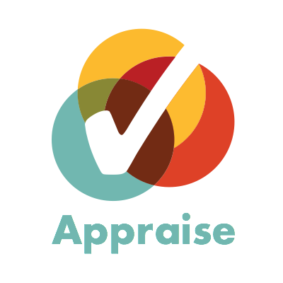
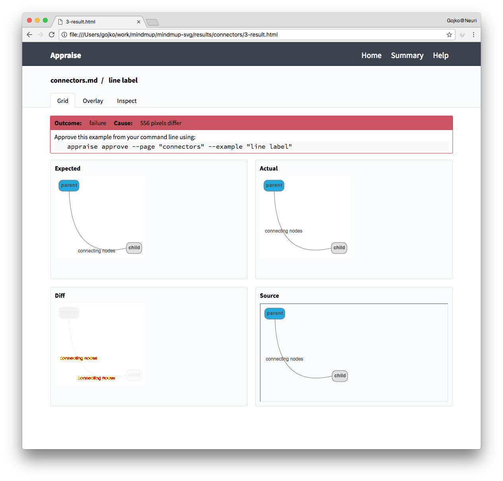

# Appraise 

## Painless visual test automation 

Appraise is a tool for visual approval testing. It can help you: 

- Review and approve changes to web pages, visual layouts and browser components quickly through visual inspection 
- Automate acceptance/regression tests for visual look and feel in a visual language, rather than xUnit style code
- Publish easily maintainable/verifiable developer docs with visual examples to Github easily (markdown) or as a static site (html)
- Start Spec by Example/BDD from a sketch (hand-drawn, wireframe, or from a graphic tool), easily compare actual outcomes, then just approve the final result to make a regression test

This is what it will help you do in the near future:

- Speed up visual exploratory testing by making it easier to rebuild visual components from example data/configuration
- Run visual tests quickly/in parallel using AWS Lambda

For a more detailed introduction on when Appraise might be useful and why we built it, check out the [Painless Visual Testing](https://vimeo.com/album/4897573/video/247763289) presentation from Agile Tour Vienna 2017.

## In action

## Examples

The files in the [Examples](examples) directory are automated tests, described in Markdown, that nicely render when viewed in GitHub and serve as living documentation for the tool. Check out the raw markdown source to see how the tests are set up. 

## Use Appraise

* Check out the [Getting started](examples/getting-started.md) guide to learn about the basics.
* The [Docs](docs/README.md) directory contains all the information on command-line arguments. 
* For more info on writing and managing tests, check out:
  * [Creating test pages](examples/creating-test-pages.md)
  * [Customising execution](examples/customising-execution.md)
  * [Fixture types](examples/fixture-types.md)
  * [Formatting examples](examples/formatting-examples.md)
  * [Controlling screenshots](examples/controlling-screenshots.md)

## Get help

Head over to the [AppraiseQA Chat on Gitter](https://gitter.im/AppraiseQA/Lobby) and let's talk about it!

## Status

**Alpha** -- useful to us, let's make it useful to you together. 

We've been using Appraise for a while now for developing [MindMup](https://www.mindmup.com) so it is quite usable for our usage scenarios, but it's likely that we've not covered 100% of what you need. 

Assume that before version 1.0, important stuff is likely going to change in a backwards-incompatible way based on community feedback.

## Contribute to Appraise

Here's a list of [tasks](tasks.md) that we plan to do, so join in and take one of those! 

## License

MIT, see the [license](LICENSE) file.

