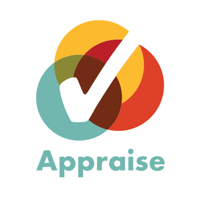

# Appraise

### Painless visual test automation 

Appraise is a tool for visual approval testing. It can help you: 

- Review and approve changes to web pages, visual layouts and browser components quickly through visual inspection 
- Automate acceptance/regression tests for visual look and feel in a visual language, rather than xUnit style code
- Publish easily maintainable/verifiable developer docs with visual examples to Github easily (markdown) or as a static site (html)
- Start Spec by Example/BDD from a sketch (hand-drawn, wireframe, or from a graphic tool), easily compare actual outcomes, then just approve the final result to make a regression test

This is what it will help you do in the near future:

- Speed up visual exploratory testing by making it easier to rebuild visual components from example data/configuration
- Run visual tests quickly/in parallel using AWS Lambda

## In action

## Status

**Alpha** -- useful for us, let's make it useful to you together. 

Important stuff is likely going to change in a backwards-incompatible way based on community feedback.

## Use Appraise

* The [Docs](docs/README.md) directory contains all the information on command-line arguments. 
* The [Examples](examples) directory contains a fully automated set of tests that illustrate the key concepts, so reading through those is a good start.

Check out the [Getting started](examples/getting-started.md) guide to learn about the basics

Here are some additional things that might be of interest, in the order of importance:

* [Creating test pages](examples/creating-test-pages.md)
* [Customising execution](examples/customising-execution.md)
* [Fixture types](examples/fixture-types.md)
* [Formatting examples](examples/formatting-examples.md)

## Contribute to Appraise

## Get help

