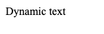

# Pass arguments to the function before screenshots 

Any code in the `beforeScreenshot` fixture result is executed in the browser context before taking the screenshot,
but the function is in the browser context, not the fixture context. This means that you can access browser DOM objects directly, but you can't access local variables from the fixture enclosure.

To pass arguments between the two contexts, set the `beforeScreenshotArgs` field on the fixture result. This
must be an array, and the elements of the arrays will be passed directly to your  `beforeScreenshot` function as individual arguments. 

## Example

This page is an executable initialising a HTML page by passing the text into a browser context before screenshot, using the
[before-screenshot-with-args.js](fixtures/before-screenshot-with-args.js).

This fixture generates some HTML that initially has a hidden element

~~~yaml example="after screenshot"
text: Dynamic text
~~~

## after screenshot

(generated: 2018-12-20 15:29:07)

