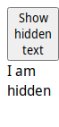

# Execute A Function in Browser Context Before Taking The Screenshot

In some cases, it can be necessary to perform actions on a fixture
prior to taking a screenshot. For example, you might want to test
a part of a fixture that is only visible after clicking a button.

You can execute a custom function after the content is generated by 
your fixture, but before the screenshot, by supplying a `beforeScreenshot` function
in your fixture.

The function will be executed in the browser's page context. The browser's 
execution context is available within the function. For example, you can access the document via
`window.document`. 

As the function is in the browser context, you can't access local variables from the fixture enclosure directly, 
but you can pass additional arguments using the `beforeScreenshotArgs` field. See an example in [before-screenshot-with-args.md](before-screenshot-with-args.md).

For asynchronous functions, return a `Promise`. Appraise will wait until the promise resolves before
taking the screenshot.

## Example

This page is an executable example of delayed screenshot execution, using the
[before-screenshot.js](fixtures/before-screenshot.js).

This fixture generates some HTML that initially has a hidden element

~~~yaml example="after screenshot"
text: I am hidden
~~~

After clicking the button, a previously hidden text appears:

