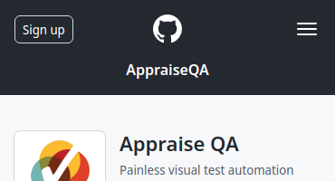

# Fixture types

> Note: this page is a fully executable spec for the options it demonstrates. If you are reading this on GitHub, it will render the page nicely and hide all the technical details, so check out the raw markdown to see the actual test configuration.


Fixtures are the link between the examples and the system under test. They automate *how* an example should be checked. Each example can define how it should be executed using two parameters:

* `fixture` names the function to use for processing examples.
* `fixture-engine` tells Appraise how to load the fixtures. 

By default, fixtures run inside [the Node.js fixture engine](../src/fixture-engines/node-fixture-engine.js), but you can provide a custom fixture engine to execute your examples using a different platform (for example an external Java or C# process), or to load JavaScript code differently (for example using webpack or some other pre-processor).

Both parameters can be set either from the command line, in the page header or in the header of an individual example.


## Node.js fixtures

In the case of Node.js fixtures (default), a fixture is just a Node module resolving to a function with two arguments: 

```js
module.exports = function myFixture(input, context) {
  //...
};
```

* `input` is the parsed input of an example (an object with key/value items). 
* `context` provides the details of the page configuration
  * `context.outputDir` is the working directory where it's safe to save files and assets (for example images or CSS files you want to use in the result)
  * `context.params` is a key-value hash object with all the example context parameters, such as values from the page YAML preamble or the header of the example

The fixtures should use this information to convert the example input into something that a browser can render and take a screenshot.

Fixtures can return anything that a headless Chrome browser can render, but they should preferably return the source information (such as a HTML page or SVG code) instead of a PNG directly, so you can inspect them in case of errors.

## Fixture types

Appraise can work with four types of fixture results:

1. An object
2. A URL
3. A local file name
4. A `Promise` resolving to any of the above (for asynchronous operations)

### Fixtures returning an object

The object result is useful when you can convert the input into a stand-alone page or file, so you do not have to save anything to the disk from the fixture. 

The object needs to provide one of the following:

* `content` and `contentType`, strings containing the actual result and the mime type
* or `url`, a string pointing to external content
* optionally with `beforeScreenshot` and `beforeScreenshotArgs` to [execute code](before-screnshot.md) before taking the screenshot.

Note that supplying content/content type only works for a small number of supported content types, listed in [supported-extensions.js](../src/config/supported-extensions.js). Appraise needs to know the right extension for a MIME type, so if the content type you want to use is not yet supported, submit a patch to that file, or use the local file fixture result, and save the page under the correct extension yourself.
  
Here is an example executed using [fixtures/object.js](fixtures/object.js):

~~~yaml example="object" fixture="fixtures/object.js"
name: AppraiseQA
~~~


### Fixtures returning a local file name

This type of fixture is useful when you want to compose the result from several files (for example a HTML page with external assets, styles or JavaScript code). It is also useful in cases when Appraise does not directly support saving the content type you want to use from an object.

In this case, make sure to save all the assets into the `context.outputDir`, and return the file name (as a string) that Appraise should load into a browser, relative to that directory.

Here is an example executed using [fixtures/file.js](fixtures/file.js):

~~~yaml example="file" fixture="fixtures/file.js"
name: AppraiseQA
~~~


### Fixtures returning a URL

This type of fixture is useful when you want to process the example on an external server, for example using Java or .NET, or when you want to test pages from a deployed web site. In this case, return the full URL (as a string) that Appraise should load into a browser.

Here is an example executed using [fixtures/url.js](fixtures/url.js):

~~~yaml example="url" fixture="fixtures/url.js" clip-width="370" clip-height="200" initial-width="370" initial-height="200"
name: AppraiseQA
~~~




### Fixtures returning a Promise

When your fixture works asynchronously, for example loading resources over a network or copying files, return a `Promise` object that resolves to any of the previous result types.

Here is an example executed using [fixtures/promise.js](fixtures/promise.js):

~~~yaml example="promise" fixture="fixtures/promise.js"
name: AppraiseQA
~~~


