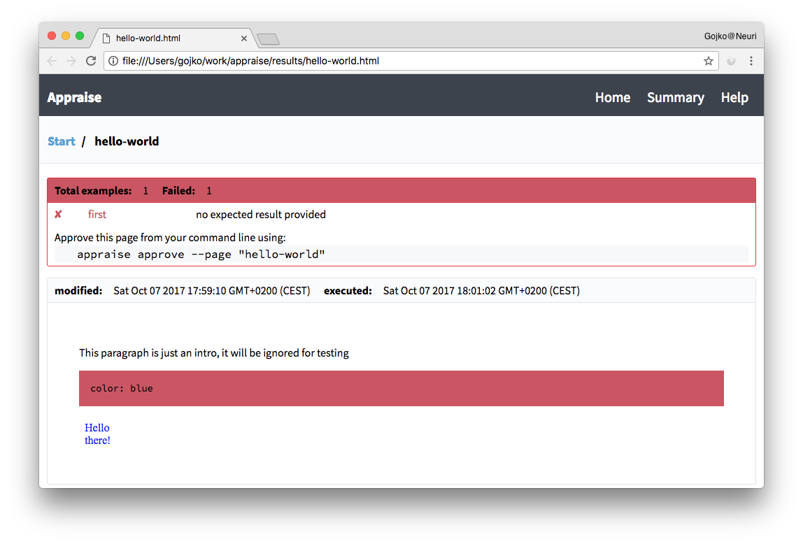
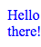
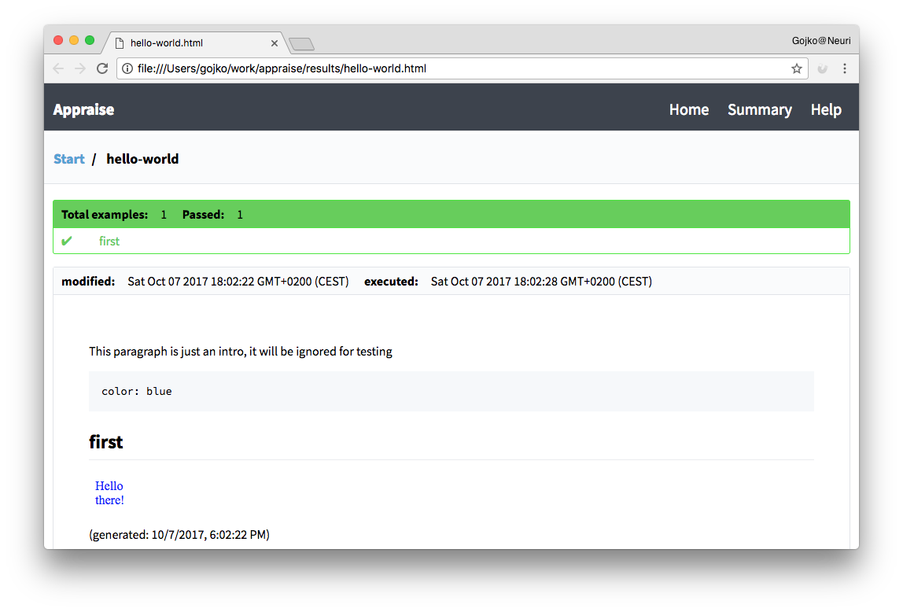
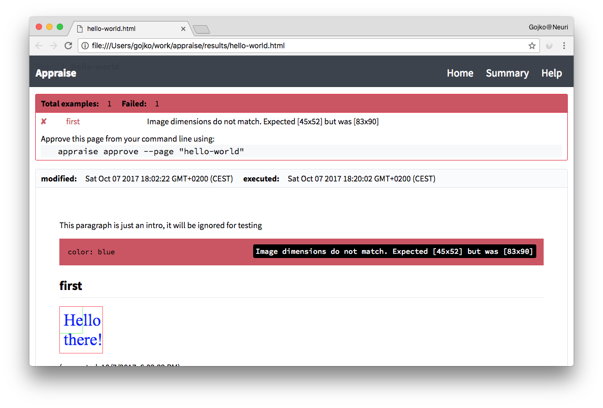
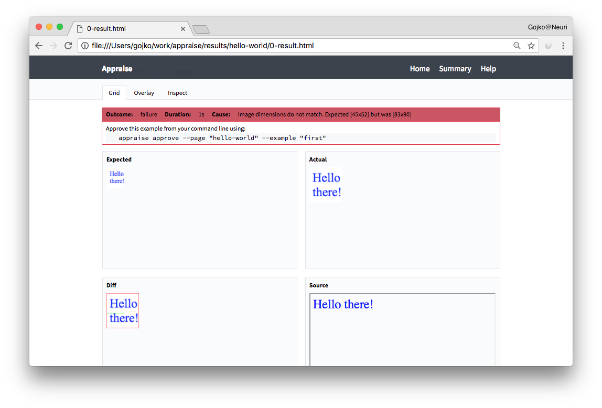

# Getting started

This guide explains how to get started with using Appraise. 

## Installing Appraise

You can easily install Appraise by using NPM:

```bash
npm install appraise -g
```

To make it simple to start, the guide shows how to use Appraise as a global command line utility. You can also use Appraise as a NPM package (development) dependency, just set up the NPM scripts to execute the corresponding command lines.

## Creating your first test page

Set up a subdirectory for your test pages. Appraise defaults this to `examples`, so for simplicity create an `examples` directory in your project.

Appraise uses Github-flavoured Markdown syntax to process test pages, so your pages will automatically show nicely in Github documentation.

Create a markdown page, for example `hello-world.md` inside the `examples` directory. Paste the following content there:

```md
This paragraph is just an intro, it will be ignored for testing

~~~yaml example="first" fixture="hello.js"
color: blue
~~~
```

This is a simple test page with a single example. On the third line, you can see some key example attributes:

1. The format of the example is specified as [YAML](http://www.yaml.org/about.html), so Appraise knows how to extract attributes from the code. 
2. The example name is `first`. You can have multiple examples on a single page, so each example must have a unique name. This will be used later to match with the expected output.
3. The fixture is `hello.js`. This tells Appraise how to interpret the example to create the actual test outcome.

**Note:** This page is overly simplistic, to explain how to get started. Notably, it does not contain an expected outcome yet, as we'll generate one automatically later. Check out the [Creating Test Pages](creating-test-pages.md) guide for a more complete reference on how to set up test pages.

## Creating your first test fixture

Test fixtures tell Appraise how to turn examples into test results. Create a file called `hello.js` in your `examples` directory and paste the following code there:

~~~js
module.exports = function (inputParams) {
  return {
    contentType: 'text/html',
    content: `<html><body>
     <div style="color: ${inputParams.color}">
     Hello there!
     </div>`
  };
};
~~~

This fixture creates a result directly, without connecting to a system under test, to make things simpler for an intro. In a real case, this would be a function that connects to your API, and renders the result in some meaningful way. There are three important things to note here:

1. The input parameters from the example are passed to the fixture as the first argument. That is why we can use `${inputParams.color}` on line 5.
2. The fixture returns an object with two properties, `contentType` and `content`. This is the simplest type of a fixture, but you can also do more complicated things such as return a remote URL, or save files to a temporary location and return the pointer to a result file. For more on this, check out the [Fixture Types](fixture-types.md) guide.
3. The `contentType` in this case is `text/html`, but Appraise can work with anything that browsers can render, including SVG, PDF, images and so on.

## Running the first test

Now run the following command from your project directory (the one containing the `examples` directory):

```bash
appraise run
```

This command should now complain that your `hello world` page has an example without an expected result.

```
hello-world
	 ✘	first 	no expected result provided
	 ✘	hello-world total: 1 failure: 1
✘	Summary total: 1 pages: 1 failure: 1
```

Appraise saves the outcome of the test in the `results` directory. Open `results/hello-world.html` in your browser, and you'll see the failed test outcome, with instructions on how to approve the result.



## Approving the test result

In this case, we started without an expected outcome, so Appraise failed the test and offers you a quick way to review the current outcome (see the blue text 'Hello World' below the example code in the browser page). If you consider it OK, then Appraise will allow you to easily capture the current status as a regression check for the next test run -- you can approve the current example outcome as the correct one. 

```bash
appraise approve --page "hello-world"
```

Appraise will take the recently produced image of your example, then save it to the examples directory and modify your test page to include the new picture. Check your `hello-world.md` page and you should see a block such as the one below:

```md
## first



(generated: 10/7/2017, 6:02:22 PM)
```

The name of the image (the part in `[]`) corresponds to the name of the example you provided at the start. This tells Appraise what to use for the expected outcome.

## Running the test again

When you run the test again, the expected and actual outcome should be the same, and the results page should show that they match. Run the following command:

```bash
appraise run
```

This should print the successful test outcome:

```
hello-world
	 ✔	first 	
	 ✔	hello-world total: 1 success: 1
✔	Summary total: 1 pages: 1 success: 1
```

Re-load `results/hello-world.html` in your browser, and you'll see the test is marked as green.



## Inspecting regression failures

From this point onwards, Appraise will use the saved image to check for regression changes. Modify the fixture, for example making the font twice as large:

~~~js
module.exports = function (inputParams) {
  return {
    contentType: 'text/html',
    content: `<html><body>
     <div style="color: ${inputParams.color}; font-size: 200%">
     Hello there!
     </div>`
  };
};
~~~

Re-run the test again, and check out the result page:

```bash
appraise run
```



The example is now red, and hovering over it will show the reason why it failed. The image below the example shows the difference in image dimensions. Click on the example or the image to go into inspect mode:



This will show you the expected outcome, the actual outcome, a quick diff, and a box where you can check the actual HTML (not just the PNG screenshot) to see what the fixture returned. You can also click on the `Overlay` tab to show the actual and expected results together and easily compare them, or the `Inspect` tab to investigate the actual HTML produced by the test. 

## Where next?

This was an overly simplistic example just to get you started. You can customise many aspects of the execution, including the directories, screenshot region and clip sizes, types of fixtures and so on. Check out the following pages next:

* [Command line arguments](../docs) for `appraise run` and `appraise approve` to set the directories containing examples, where to save results, and where to look for fixtures
* [Creating Test Pages](creating-test-pages.md) for more information on the structure of test pages, and how to configure examples


