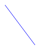

# A trivial example for SVG image testing

---
fixture: fixtures/path.js
---

A fenced code block with an example parameter will set the code for an example:

~~~json example="blue line"
{
  "path": "M10,10L20,20",
  "color": "blue"
}
~~~

An image with a matching description will set the expected output for the example:

